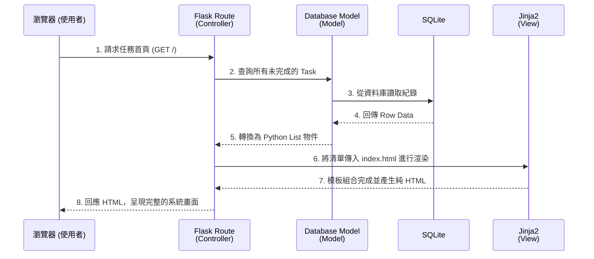

# 任務管理系統 - 系統架構設計 (Architecture)

## 1. 技術架構說明

本系統為輕量級的網頁應用程式，採用傳統的 Server-Side Rendering (SSR) 架構，前端與後端整合在同一個專案內，藉此縮短開發時間並加快 MVP 推出的速度。主要技術選型如下：

- **後端框架：Python + Flask**
  - **原因**：Flask 是輕量、彈性且學習曲線平緩的 Python Web 框架，對於小型團隊實作任務管理系統來說，具備隨插即用的靈活性。
- **模板引擎：Jinja2**
  - **原因**：內建於 Flask 中負責擔任 HTML 渲染器。它可以在後端直接將查詢到的任務資料與 HTML 版型結合，並輸出成完整的網頁給使用者。
- **資料庫：SQLite**
  - **原因**：SQLite 不需額外安裝或設定龐大的資料庫伺服器。它的架構就是單一檔案，即可完美支援我們任務建立與查詢的資料保存需求。

### Flask MVC 模式說明
- **Model (資料模型)**：負責定義資料庫的表結構（例如 `Task` 模型），並將應用程式的邏輯操作轉換成實體的 SQL 動作。
- **View (視圖)**：由 Jinja2 模板（`*.html` 文件）負責。不處理業務邏輯，單純接收變數並產生最終呈現給使用者的網頁畫面。
- **Controller (控制器)**：由 Flask 的 **Routes（路由）** 負責。它如同指揮官，接收瀏覽器傳來的 HTTP 請求（如 "儲存任務"），指引 Model 去資料庫完成任務操作，接著把資料倒給 View (Jinja2) 生成畫面，最後將畫面送回瀏覽器。

## 2. 專案資料夾結構

為了讓程式碼好維護、好擴充，我們將系統依據職責切分成不同的資料夾與檔案：

```text
web_app_development/
├── app/                  # 應用程式主要資料夾
│   ├── __init__.py       # Flask 應用程式初始化宣告與設定
│   ├── models/           # (Model) 資料庫模型定義
│   │   └── task.py       # 任務資料結構與資料庫 Schema 定義
│   ├── routes/           # (Controller) URL 路由與業務處理
│   │   └── task_routes.py# 處理任務 CRUD 的 HTTP 請求
│   ├── templates/        # (View) Jinja2 HTML 模板檔
│   │   ├── base.html     # 共用頁面版型 (Menu/Header/Footer)
│   │   ├── index.html    # 首頁 (顯示任務清單與儀表板)
│   │   └── edit.html     # 任務新增/編輯表單頁面
│   └── static/           # CSS、JavaScript 與圖片等靜態檔
│       ├── style.css     # 全域樣式表
│       └── script.js     # 輕量級的介面互動邏輯 (如動畫)
├── instance/             # 存放特定於本地環境生成的資料
│   └── database.db       # SQLite 實體資料庫檔案 (不進版本控制)
├── docs/                 # 系統文件
│   ├── PRD.md            # 產品需求文件
│   └── ARCHITECTURE.md   # [本文件] 系統架構與設計
├── requirements.txt      # 開發此專案所需的 Python 依賴套件清單
└── run.py                # 啟動命令與應用程式執行入口
```

## 3. 元件關係圖

以下透過圖表展示當使用者進入「任務列表頁面」時，後端元件與資料庫的協作流程：



## 4. 關鍵設計決策

1. **採用 Server-Side Rendering (SSR)**
   - **考量**：不採用前後端分離 (如 React/Vue 接 REST API)。透過 Jinja2 一次性在後方渲染能減少 API 規劃的複雜度與維護成本，最適合快速建立任務與編輯的 MVP。
2. **採用 SQLAlchemy 做為 ORM**
   - **考量**：透過 SQLAlchemy 操作物件，而不是直接寫原生的 SQL 語法。這樣不僅防範了基礎的 SQL Injection，將來就算我們想把資料庫換成 PostgreSQL 或 MySQL，大部分程式碼都不用改。
3. **路由(Routes)與模型(Models)抽離化設計**
   - **考量**：不把所有的程式碼塞在一個肥大的 `app.py` 中。未來若要新增「使用者管理」或「專案管理」等功能，只需在 `routes` 和 `models` 增加 `user.py` 或 `project.py`，專案架構就能維持整潔與高延展性。
4. **集中管理基礎佈局 (Base Template)**
   - **考量**：建立 `base.html`，所有的子頁面都去繼承它。如果未來需要更換整個系統的主題顏色或是導覽列樣式，只需修改這一個基礎版型，其餘頁面皆能一次同步。
