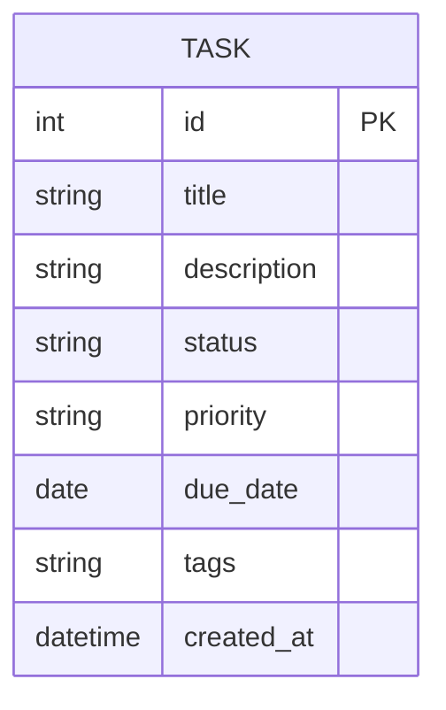

# 資料庫設計文件 (Database Design)

## 1. ER 圖 (實體關係圖)

## 2. 資料表詳細說明

### TASK 表

此資料表負責儲存系統建立的所有任務。考量初期為 MVP 並降低複雜度，將優先級、狀態與標籤作為一般欄位設計。

| 欄位名稱 | 型別 | 必填 | 預設值 | 說明 |
| --- | --- | --- | --- | --- |
| id | INTEGER | 是 | (AUTOINCREMENT) | 主鍵 |
| title | TEXT | 是 | - | 任務標題 |
| description | TEXT | 否 | - | 任務詳細描述 |
| status | TEXT | 是 | 'To Do' | 任務狀態 (To Do, In Progress, Done) |
| priority | TEXT | 否 | 'Medium' | 優先級別 (High, Medium, Low) |
| due_date | DATE | 否 | - | 截止日期 (YYYY-MM-DD) |
| tags | TEXT | 否 | - | 任務的分類或標籤 (以字串儲存，可用逗號分隔) |
| created_at | DATETIME | 是 | CURRENT_TIMESTAMP | 任務建立時間 |

## 3. SQL 建表語法

本專案採用的 SQLite 相對單純，完整的資料表建置語法已儲存於 `database/schema.sql` 供參考。

## 4. Python Model 程式碼

依架構設計 (採用 SQLAlchemy 作為 ORM 防範 SQL Injection、具擴充彈性)，其 Model 定義實作與相關 CRUD 操作皆儲存在 `app/models/task.py` 中。
