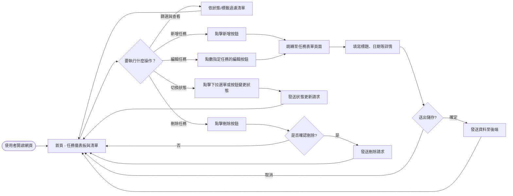
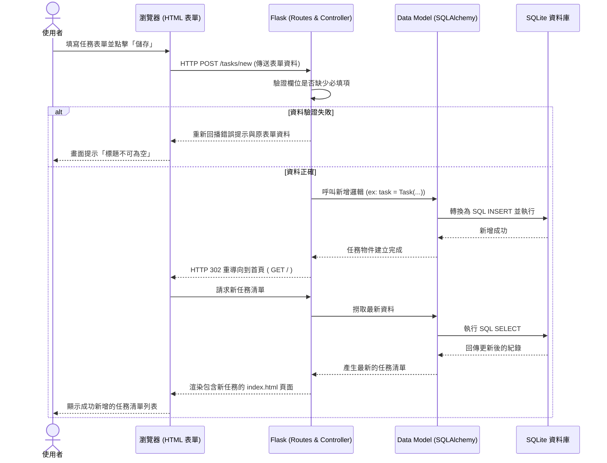

# 任務管理系統 - 系統架構與流程圖 (Flowchart)

本文件透過視覺化的方式，呈現「任務管理系統」中，使用者的操作路徑（User Flow）以及系統內部的資料處理流程（Sequence Diagram），幫助團隊明確理解各功能的串接方式。

## 1. 使用者流程圖（User Flow）

這張流程圖說明了使用者從進入首頁開始，如何進行任務的增刪查改（CRUD）以及改變狀態等操作，以及每個操作最後如何導回主要的任務清單畫面：

## 2. 系統序列圖（Sequence Diagram）

以下序列圖以使用者最常操作的「新增任務」為例，說明資料是如何從使用者的瀏覽器送至後端 Flask，最後寫入 SQLite 資料庫的完整往返流程：

## 3. 功能清單與路由（Route）對照表

我們將 MVP 所需的功能直接 mapping 到以下 URL 路由上。採用 RESTful 風格搭配傳統的表單 POST 行為（為了確保沒有 JavaScript 也能正常運作）：

| 功能 | HTTP 方法 | URL 路徑 | 說明 |
| :--- | :--- | :--- | :--- |
| **檢視首頁/列表** | GET | `/` | 系統入口，渲染儀表板與所有任務清單 |
| **新增任務 (頁面)** | GET | `/tasks/new` | 呈現新增表單供使用者填寫 |
| **新增任務 (儲存)** | POST | `/tasks/new` | 接收表單並將資料寫入 DB，儲存後跳轉回首頁 |
| **編輯任務 (頁面)** | GET | `/tasks/edit/<int:id>` | 呈現包含舊資料的表單，以便使用者修改 |
| **編輯任務 (儲存)** | POST | `/tasks/edit/<int:id>` | 將更新後的表單值寫入該 ID 的紀錄，寫入後跳轉 |
| **更新任務狀態** | POST | `/tasks/<int:id>/status` | 單純處理狀態（待辦等）快速切換的請求 |
| **刪除任務** | POST | `/tasks/<int:id>/delete` | 接收刪除需求，執行資料庫移除指定任務 |

> **設計撇步**：雖然標準的 REST API 刪除通常會用 `DELETE` 方法，更新用 `PUT` / `PATCH`，但由於傳統的 HTML `<form>` 表單僅原生支援 `GET` 和 `POST`，在不依賴 Ajax 的情況下，刪除與更新使用 `POST` 是傳統 Flask MVP 常見且穩定的作法。
