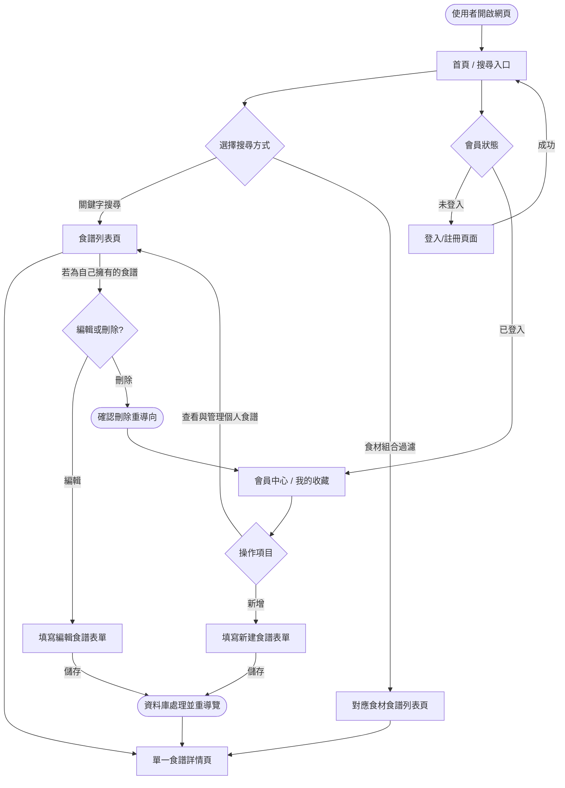
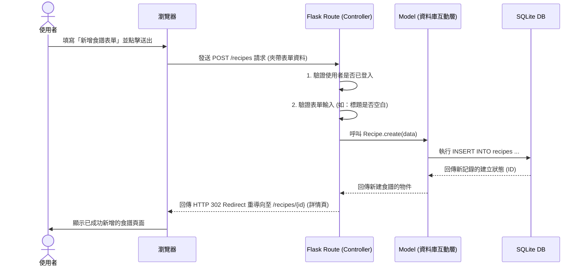

# 系統流程圖與使用者操作路徑 (Flowcharts) - 食譜收藏夾系統

以下文件根據現有的 [PRD.md](./PRD.md) 和 [ARCHITECTURE.md](./ARCHITECTURE.md) 設計，透過視覺化圖表釐清使用者的操作路徑與後端的資料流，並定義出各個功能的對應路由。

## 1. 使用者流程圖（User Flow）

此流程圖呈現一般使用者從進入網站開始，可能採取的各項操作行為。包含了「身份驗證」、「瀏覽與搜尋」以及「食譜管理」等核心情境。

## 2. 系統序列圖（Sequence Diagram）

此圖以「**使用者新增食譜**」這項操作為例，詳細描繪了整個系統後端（MVC 架構）的運作順序——從網頁送出請求到資料庫存取並回傳重新導向的流程。

## 3. 功能清單對照表

本清單列出未來將實作的功能，以及對應的 URL 路徑 (Routes) 和 HTTP 請求方法。由於原生 HTML 表單僅支援 GET 與 POST，故我們在更新/刪除資源時會透過 `POST` 方法加上特定後綴路徑來實作。

| 功能模塊 | 具體功能描述 | HTTP 方法 | URL 路徑 (Route) | 備註 |
| --- | --- | --- | --- | --- |
| **公開瀏覽** | 網站首頁 | GET | `/` | 顯示搜尋框與推薦食譜 |
| | 食譜列表與搜尋結果 | GET | `/recipes` | 若帶有 `?q=` 參數則為關鍵字搜尋 |
| | 食材組合過濾搜尋 | GET | `/recipes/search_by_ingredients` | 依據選擇的多樣食材進行過濾 |
| | 檢視單一食譜詳情 | GET | `/recipes/<int:recipe_id>` | 查看公開的食譜 |
| **會員管理** | 註冊帳號頁面與處理 | GET / POST | `/register` | 包含頁面渲染(GET)與表單送出(POST) |
| | 登入頁面與處理 | GET / POST | `/login` | 驗證帳密並建立 Session |
| | 登出處理 | GET | `/logout` | 清除使用者 Session |
| **食譜管理 (需登入)** | 新增食譜頁面 | GET | `/recipes/new` | 提供空白輸入表單 |
| | 儲存新食譜資料 | POST | `/recipes` | 將表單接收並寫入資料庫 |
| | 編輯食譜頁面 | GET | `/recipes/<int:recipe_id>/edit` | 將既有資料填入表單讓使用者修改 |
| | 儲存修改的食譜 | POST | `/recipes/<int:recipe_id>/update` | 儲存使用者更新的資料 |
| | 刪除食譜 | POST | `/recipes/<int:recipe_id>/delete` | 驗證擁有者身分或管理員權限後刪除 |
| **後台管理** | 管理員儀表板 | GET | `/admin` | 僅允許管理員檢視全域食譜與用戶列表 |
